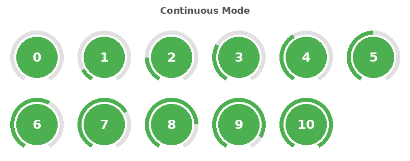
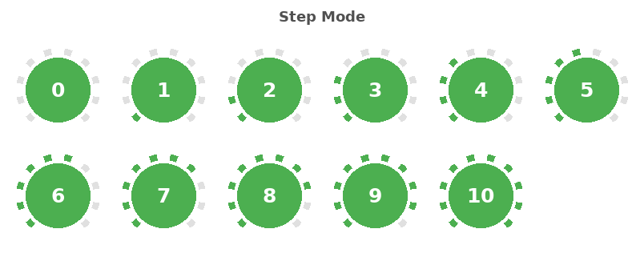
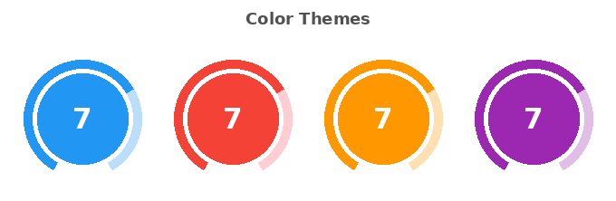
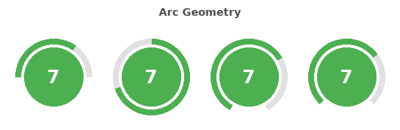
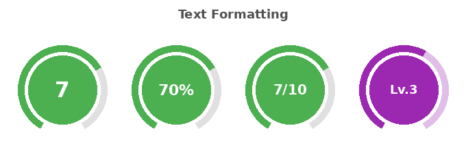
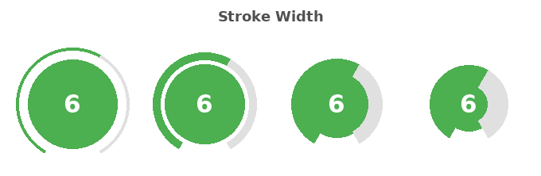
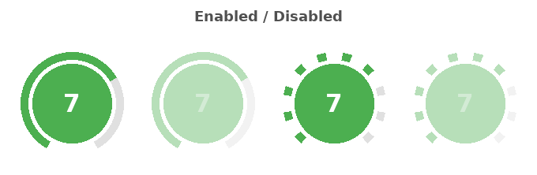
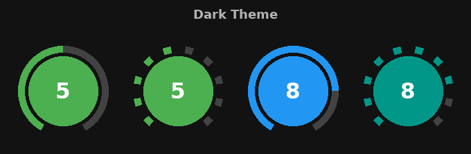

# LevelProgressBar

A Jetpack Compose circular progress bar with **continuous** and **segmented** arc modes.

[](LICENSE)

<p align="center">
  
</p>

<p align="center">
  
</p>

---

## Installation

```gradle
implementation "io.github.rezaiyan:levelprogressbar:2.0.0"
```

## Quick Start

```kotlin
// That's it - sensible defaults out of the box
LevelProgressBar(level = 7)
```

<p align="center">
  
</p>

## Features

### Two Progress Modes

| Continuous | Step |
|:---:|:---:|
| A single arc fills proportionally | Discrete segments light up |

```kotlin
LevelProgressBar(
    level = 5,
    mode = ProgressMode.Continuous, // default
)

LevelProgressBar(
    level = 5,
    mode = ProgressMode.Step,
)
```

### Color Themes

Fully customizable via `LevelProgressBarDefaults.colors()`:

<p align="center">
  
</p>

```kotlin
LevelProgressBar(
    level = 7,
    colors = LevelProgressBarDefaults.colors(
        progressColor = Color(0xFF2196F3),
        trackColor = Color(0xFFBBDEFB),
        backgroundColor = Color(0xFF2196F3),
        textColor = Color.White,
    ),
)
```

### Arc Geometry

Control `startAngle` and `sweepAngle` to create half-circles, full rings, or any arc shape:

<p align="center">
  
</p>

```kotlin
// Half circle (bottom)
LevelProgressBar(level = 7, startAngle = 180f, sweepAngle = 180f)

// Full ring
LevelProgressBar(level = 7, startAngle = 270f, sweepAngle = 360f)

// Default (300-degree arc)
LevelProgressBar(level = 7)
```

### Text Formatting

Use `formatLevel` to display percentages, fractions, or labels. Use `textStyle` for font control:

<p align="center">
  
</p>

```kotlin
// Percentage
LevelProgressBar(level = 7, formatLevel = { "$it%" })

// Fraction
LevelProgressBar(level = 7, maxLevel = 10, formatLevel = { "$it/10" })

// Custom font
LevelProgressBar(
    level = 3,
    textStyle = TextStyle(fontSize = 18.sp, fontWeight = FontWeight.Light),
)
```

### Custom Center Content

Replace the default text with any composable using the `content` slot:

```kotlin
LevelProgressBar(level = 7) { currentLevel ->
    Icon(
        imageVector = Icons.Default.Star,
        contentDescription = null,
        tint = Color.White,
        modifier = Modifier.size(48.dp),
    )
}
```

### Stroke Width

<p align="center">
  
</p>

```kotlin
LevelProgressBar(level = 6, strokeWidth = 5.dp)
LevelProgressBar(level = 6, strokeWidth = 15.dp)
LevelProgressBar(level = 6, strokeWidth = 25.dp)
```

### Enabled / Disabled

Disabled state reduces alpha to 40%:

<p align="center">
  
</p>

```kotlin
LevelProgressBar(level = 7, enabled = false)
```

### Dark Theme

<p align="center">
  
</p>

```kotlin
LevelProgressBar(
    level = 5,
    colors = LevelProgressBarDefaults.colors(
        progressColor = Color(0xFF4CAF50),
        trackColor = Color(0xFF424242),
    ),
)
```

## API Reference

### LevelProgressBar

```kotlin
@Composable
fun LevelProgressBar(
    level: Int,
    modifier: Modifier = Modifier,
    maxLevel: Int = 10,
    colors: LevelProgressBarColors = LevelProgressBarDefaults.colors(),
    strokeWidth: Dp = 10.dp,
    strokeCap: StrokeCap = StrokeCap.Round,
    startAngle: Float = 120f,
    sweepAngle: Float = 300f,
    mode: ProgressMode = ProgressMode.Continuous,
    enabled: Boolean = true,
    animated: Boolean = true,
    animationSpec: AnimationSpec<Float> = LevelProgressBarDefaults.animationSpec(),
    textStyle: TextStyle? = null,
    formatLevel: ((Int) -> String)? = null,
    content: (@Composable (level: Int) -> Unit)? = null,
)
```

| Parameter | Type | Default | Description |
|:---|:---|:---|:---|
| `level` | `Int` | *required* | Current level, clamped to `0..maxLevel` |
| `modifier` | `Modifier` | `Modifier` | Layout modifier |
| `maxLevel` | `Int` | `10` | Maximum level (must be > 0) |
| `colors` | `LevelProgressBarColors` | `LevelProgressBarDefaults.colors()` | Color configuration |
| `strokeWidth` | `Dp` | `10.dp` | Arc stroke thickness |
| `strokeCap` | `StrokeCap` | `Round` | Arc end cap style (`Round`, `Butt`, `Square`) |
| `startAngle` | `Float` | `120f` | Arc start angle in degrees (0 = 3 o'clock) |
| `sweepAngle` | `Float` | `300f` | Total arc sweep in degrees |
| `mode` | `ProgressMode` | `Continuous` | `.Continuous` or `.Step` |
| `enabled` | `Boolean` | `true` | Disabled = 40% alpha |
| `animated` | `Boolean` | `true` | Animate level changes |
| `animationSpec` | `AnimationSpec<Float>` | `tween(1500ms)` | Animation configuration |
| `textStyle` | `TextStyle?` | `null` | Override the default level text style |
| `formatLevel` | `((Int) -> String)?` | `null` | Custom text formatter (e.g. `{ "$it%" }`) |
| `content` | `@Composable?` | `null` | Replaces the level text with custom content |

### LevelProgressBarDefaults

| Member | Value |
|:---|:---|
| `MaxLevel` | `10` |
| `StrokeWidth` | `10.dp` |
| `MinSize` | `250.dp` |
| `Mode` | `ProgressMode.Continuous` |
| `StrokeCap` | `StrokeCap.Round` |
| `StartAngle` | `120f` |
| `SweepAngle` | `300f` |
| `colors()` | Green progress, light gray track, white text |
| `animationSpec()` | `tween(1500ms, FastOutSlowInEasing)` |

## Migration from 1.x

The 1.x API is deprecated but still functional:

```kotlin
// 1.x (deprecated)
LevelProgressBar(
    level = 5,
    progressColor = Color.Red,
    unProgressColor = Color.LightGray,
    isStepProgress = true,
)

// 2.x (recommended)
LevelProgressBar(
    level = 5,
    colors = LevelProgressBarDefaults.colors(
        progressColor = Color.Red,
        trackColor = Color.LightGray,
    ),
    mode = ProgressMode.Step,
)
```

## Screenshot Testing

Uses [Paparazzi](https://github.com/cashapp/paparazzi) for JVM screenshot tests (no emulator needed).

```bash
./gradlew :progressbar:recordPaparazziDebug   # Record golden images
./gradlew :progressbar:verifyPaparazziDebug    # Verify against golden images
```

## License

```
Copyright 2020 alirezaiyann@gmail.com

Licensed under the Apache License, Version 2.0 (the "License");
you may not use this file except in compliance with the License.
You may obtain a copy of the License at

   http://www.apache.org/licenses/LICENSE-2.0

Unless required by applicable law or agreed to in writing, software
distributed under the License is distributed on an "AS IS" BASIS,
WITHOUT WARRANTIES OR CONDITIONS OF ANY KIND, either express or implied.
See the License for the specific language governing permissions and
limitations under the License.
```
